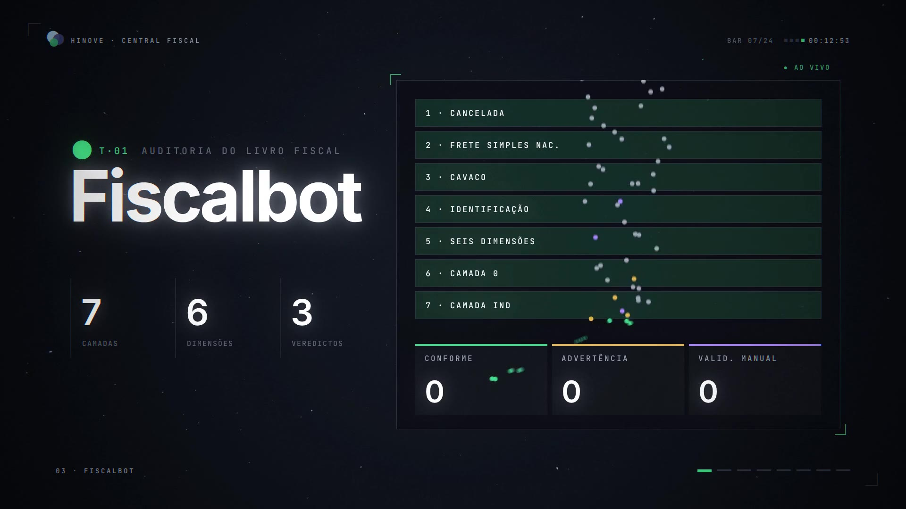

# Central Fiscal · reel

Quarenta e cinco segundos de motion design, 1080p60 e 128 BPM: a Central Fiscal e as
oito ferramentas contadas como um reel. São 24 compassos, e cada corte cai numa batida.

[](central-fiscal-reel.mp4)

▶ **[central-fiscal-reel.mp4](central-fiscal-reel.mp4)** · ou abra o [`reel.html`](reel.html) para assistir ao vivo
(espaço pausa)

## Roteiro

| Compassos | Início | Cena | O que acontece |
|---|---|---|---|
| 1–2 | 0,00 s | Ignição | Um ponto pulsa, vira régua de 1 px e volta. Estoura em três notas: as três bolas da Hinove. *Hinove · Central Fiscal* sobe, e a marca voa para o canto, montando o HUD |
| 3–4 | 3,75 s | Manifesto | *Macros. Planilhas. Scripts soltos.* batem uma por tempo. Um fio verde risca as quatro palavras, que viram ~7 mil partículas e remontam *Uma tela.* Tudo colapsa num ponto |
| 5–6 | 7,50 s | Sistema | No drop, a marca abre três órbitas. A câmera 3D inclina do topo para o plano oblíquo e as oito ferramentas nascem em colcheias, cada uma com a sua nota. Mergulho no Fiscalbot |
| 7–18 | 11,25 s | Ferramentas | Oito capítulos de seis tempos. O disco da cor da ferramenta cobre a tela e se recolhe no orbe do nome; à direita, o instrumento que reproduz a regra dela: a cascata do Fiscalbot, o encaixe da carga do Apurabot, o túnel de `.zip` do DiXML, a esteira do GerarPendentes, as quatro peneiras do GerarServPend, os medidores e a célula âmbar da Base de conhecimento, o painel do Resumo Executivo, e o caminhão na balança com o carimbo do Faturabot |
| 19–20 | 33,75 s | Fluxo | Origem → ferramenta → entrega, com os documentos em trânsito. *Nenhuma ferramenta importa outra.* O mapa se fecha num ponto |
| 21–22 | 37,50 s | Números | 8 · 742 · 19,5 mil · 0 — um por meio compasso. O zero se abre em anel e vira horizonte |
| 23–24 | 41,25 s | Assinatura | As três bolas nascem atrás do limbo: *Menos procurar erro. Mais analisar número.* A marca sobe, a palavra-marca entra e uma órbita fecha em volta |

Os números vêm do repositório (testes, linhas de motor) e dos docs (99,87%, 44/44, 127,
141). Placas, pesos, chaves e parceiros são fictícios.

## Como é feito

- **`reel.html` + `js/`**: o reel inteiro é uma função pura do tempo desenhada em canvas 2D.
  Qualquer quadro sai igual em qualquer ordem e em qualquer processo.
- A técnica e o núcleo (`core.js`: curvas, molas, câmera 3D, tipografia por letra) vêm do
  showreel do órbita, no repositório horbita. As cenas são novas.
- **`render.mjs`**: Chromium headless em 4 processos, motion blur por subamostragem (5
  amostras, 10 nos trechos rápidos, obturador de 180°), bloom com limiar, aberração cromática
  nos impactos, vinheta e grão. O RGBA cru vai direto para o ffmpeg (H.264, BT.709).
- **`audio/`**: trilha sintetizada com numpy e scipy. Cada ferramenta tem uma nota, a mesma do
  planeta dela; o carimbo do Faturabot, o encaixe do Apurabot e as peneiras do GerarServPend
  têm o seu som. Mix em −14 LUFS.

## Renderizando

```bash
cd vitrine/reel
python3 audio/soundtrack.py trilha.wav                 # trilha (numpy + scipy)
node render.mjs video --audio trilha.wav               # 1080p60 → central-fiscal-reel.mp4
node render.mjs stills --times 5.5,12.4,33.4           # quadros soltos para revisão
node render.mjs video --scale 0.5 --samples 1          # prévia rápida
```

Requer Node com Playwright (Chromium) e um ffmpeg com libx264 (o do pacote
`imageio-ffmpeg` serve; ou `FFMPEG=/caminho/do/ffmpeg`). As fontes vêm de `../fontes`.
